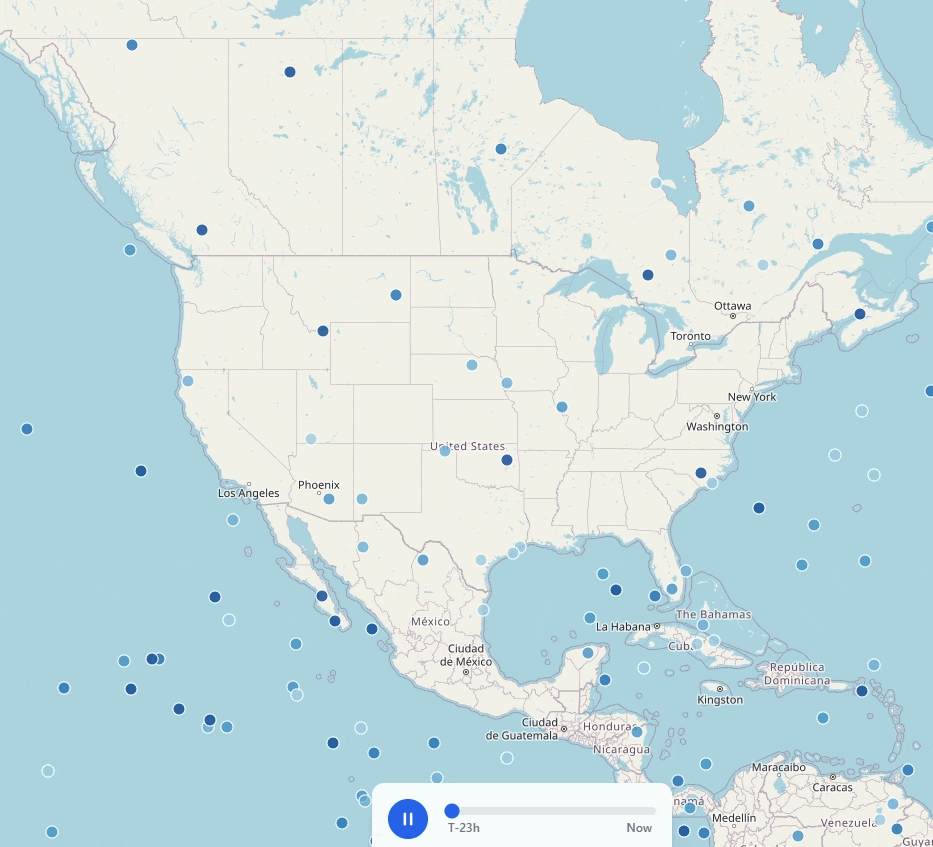
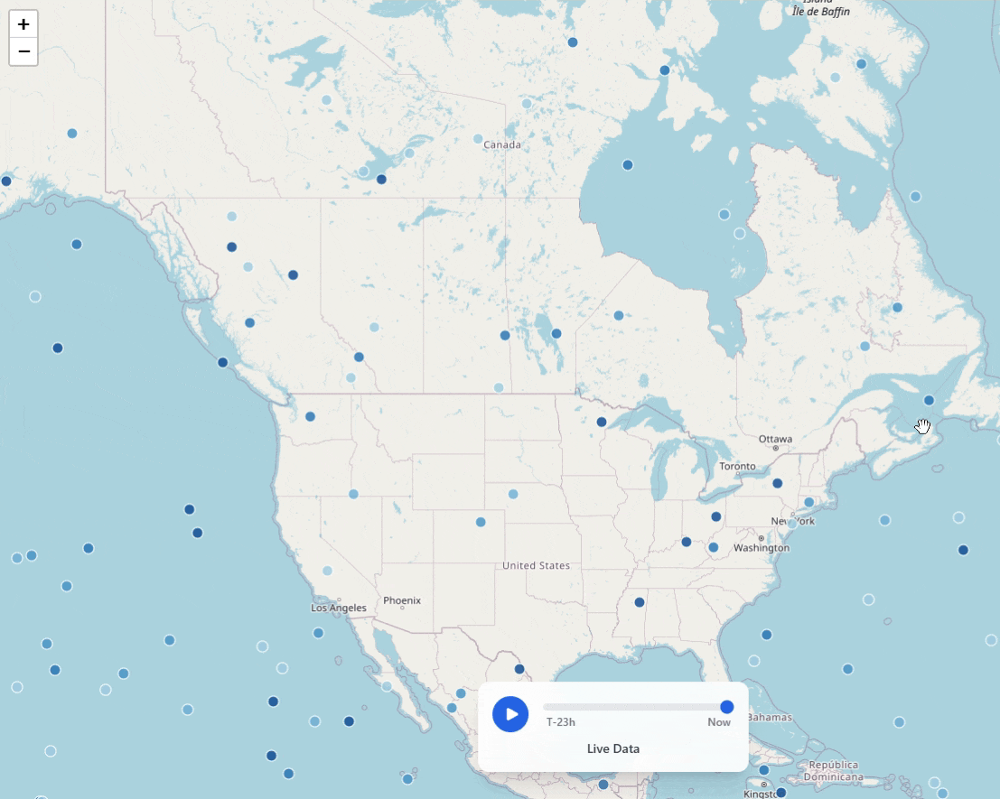
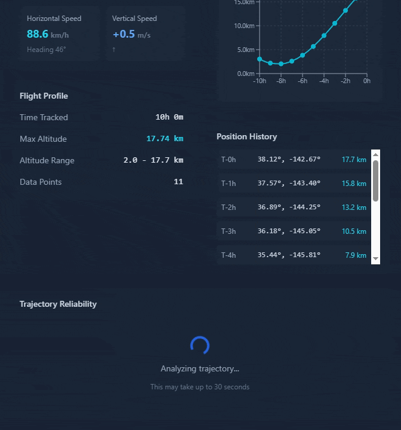

# SondeLink - Weather Balloon Mission Control

**Live Demo**: [https://sonde-link.vercel.app/](https://sonde-link.vercel.app/)

Track and predict the movement of WindBorne's global weather balloon constellation in real-time.

---

## Key Features

### Real-Time Tracking
Live positions of 1,000+ weather balloons updated hourly from the Windborne API, with persistent tracking IDs across the last 24 hours of data.

### 24-Hour History
Interactive time slider to replay historical balloon positions. Scrub through the past 24 hours to see movement patterns.

### Trajectory Prediction
Predict future balloon positions using hybrid algorithms combining historical velocity and wind data from Open-Meteo.

---

## See It in Action

### Interactive 24-Hour Playback


Drag the time slider to scrub through the past 24 hours of balloon positions. Watch the entire constellation shift as weather patterns push balloons across continents. The slider updates all 1,000+ balloon markers in real-time.

### Balloon Detail Panel


Click any balloon to see its full stats: current altitude, coordinates, velocity, and trajectory predictions. The panel shows where the balloon has been and where it's likely headed based on wind patterns and historical movement.

### Accuracy Analysis


Compare predicted vs actual balloon positions over time. The chart visualizes prediction error to show how well the hybrid algorithm (combining velocity-based and wind-based forecasting) performs. Lower values mean more accurate predictions.

---

## Technical Approach

### Tracking Algorithm
Balloons are tracked across hourly snapshots using a sophisticated two-phase matching algorithm:

**Phase 1 - Greedy Matching:** Unambiguous matches are resolved quickly using an R-tree spatial index. Bidirectional conflict detection ensures that contested positions (where multiple balloons could match) are deferred to the optimal solver.

**Phase 2 - Hungarian Algorithm:** Conflicting matches are resolved using the Munkres algorithm for globally optimal bipartite matching, preventing greedy assignment errors.

**Scoring System:** A normalized, weighted scoring system evaluates matches based on:
- **Direction continuity (55%)** - Balloons follow smooth curved paths; direction changes >45° are rejected
- **Altitude similarity (20%)** - Quadratic penalty for altitude changes; >10km changes are rejected
- **Distance from prediction (15%)** - Velocity-based position prediction with quadratic scoring
- **Speed consistency (10%)** - Log-scale penalty for extreme speed changes

**Velocity Estimation:** Uses weighted averaging of up to 3 historical positions for stable direction/speed predictions, handling natural trajectory variations.

IDs persist in the database to maintain consistency across server restarts.

### Production Database
PostgreSQL (Neon) provides scalable cloud storage with connection pooling and automated backups. The adapter pattern enables seamless switching between SQLite (local development) and Postgres (production). Composite keys (balloon_id, timestamp) ensure data integrity, while wind data caching minimizes external API calls.

### Wind Integration
Open-Meteo's free atmospheric API provides wind vectors at multiple pressure levels. Altitude-to-pressure conversion enables accurate wind data retrieval for trajectory prediction, which combines velocity-based and wind-based forecasting for improved accuracy.

**Why Open-Meteo?** Open-Meteo offers free, high-quality atmospheric data at multiple pressure levels without rate limits or API keys. Its global coverage and hourly updates match the Windborne API cadence perfectly. The availability of upper-air wind data (essential for balloon trajectory prediction) combined with zero cost made it the ideal choice for this project. Alternative weather APIs either lack upper-air data, have restrictive rate limits, or require paid subscriptions.

### Map Visualization
Leaflet with marker clustering handles 1,000+ balloons with smooth performance. World wrapping enables infinite horizontal scrolling, with toggleable clustering and altitude-based color coding for visual data segmentation.

### Performance
Client-side position interpolation using React's useMemo enables smooth time slider scrubbing without additional API requests. Backend caching of API responses and Vercel's serverless edge functions ensure fast response times globally. Database connection pooling in Neon minimizes cold start latency.

---

## Design Choices & Future Work

### Key Design Decisions

**Why React over Vue or Angular?**
React's lightweight nature and useMemo/useCallback hooks make it ideal for performance-critical map rendering with frequent position updates. The component model maps cleanly to map features (markers, trajectories, panels). Vue would work fine too, but React's ecosystem has better Leaflet integration. Angular's heavier framework would be overkill for this use case.

**Why Leaflet instead of Mapbox or Google Maps?**
Leaflet is open-source with no API costs or rate limits, crucial for a prototype that might get heavy traffic. It handles 1,000+ markers well with clustering, supports world wrapping natively, and has a cleaner API for custom overlays. Mapbox has better aesthetics but isn't necessary when the focus is on data visualization rather than base map beauty.

**Why not use WebSockets for real-time updates?**
The Windborne API updates hourly, making WebSockets overkill. Polling with configurable refresh intervals keeps the architecture simple while matching the data cadence. For sub-minute updates, WebSockets or Server-Sent Events would make more sense.

**How does balloon tracking handle data gaps and jumps?**
The algorithm uses multiple hard gates to reject impossible matches: 600km maximum distance (accounting for extreme jet stream speeds), 10km maximum altitude change, and 45° maximum direction change per hour. A two-phase matching system (greedy + Hungarian algorithm) with bidirectional conflict detection prevents balloons from "stealing" each other's positions. Direction continuity is weighted at 55% of the match score, ensuring balloons follow their natural curved trajectories. Balloons that can't be matched within these constraints are marked as lost and reassigned new IDs.

**Why Vercel for hosting?**
Vercel's serverless architecture handles backend API requests efficiently with automatic scaling and zero cold starts after the first request. The global edge network ensures low latency worldwide. Separate frontend and backend deployments allow independent scaling and simpler CI/CD. Plus, the free tier is generous enough for this use case.

### Potential Enhancements

**Tawhiri API Integration**
Tawhiri provides high-resolution wind predictions specifically designed for balloon trajectory forecasting. Integrating it would significantly improve path prediction accuracy compared to Open-Meteo's general atmospheric data, especially for high-altitude balloons in complex wind regimes.

**SondeHub API v2 Integration**
SondeHub aggregates real-time radiosonde (weather balloon) data from global amateur radio networks. Cross-referencing Windborne positions with SondeHub telemetry could validate tracking accuracy, detect anomalies, and potentially source actual atmospheric measurements (temperature, pressure, humidity) for richer visualization.

**Telemetry Data Visualization**
If actual sensor data were available (temperature, pressure, humidity profiles), the app could display vertical atmospheric profiles, detect fronts and jet streams, and show how balloon trajectories correlate with weather phenomena. Time-series charts could reveal measurement quality and sensor drift over balloon lifetime.

**Predictive Flight Path Optimization**
With historical flight data and wind patterns, machine learning could predict optimal launch times and locations for target destinations. This would be valuable for mission planning, whether for weather data collection or point-to-point navigation experiments.

**OSSE for Data Assimilation Impact**
An Observing System Simulation Experiment could quantify how Windborne's balloon observations improve weather forecast accuracy. By simulating the impact of different balloon constellation configurations on numerical weather prediction models, this would demonstrate the value of strategic balloon placement and help optimize future deployment strategies.

---

## Tech Stack

**Frontend:**
- React + TypeScript
- Vite (build tool)
- Tailwind CSS (styling)
- Leaflet (map visualization)
- React Router (navigation)

**Backend:**
- Node.js + Express
- PostgreSQL (Neon serverless)
- SQLite (local development)
- Open-Meteo API (wind data)

**Infrastructure:**
- Vercel (frontend & backend hosting)
- Neon (PostgreSQL database)
- cron-job.org (hourly data refresh scheduler)
- Database adapter pattern (seamless SQLite ↔ Postgres switching)

---

## Getting Started

### Prerequisites
- Node.js 18+ and npm
- Git

### Local Development

1. **Clone the repository**
```bash
git clone <repository-url>
cd web-dev-challenge
```

2. **Install dependencies**
```bash
# Frontend
cd frontend
npm install

# Backend
cd ../backend
npm install
```

3. **Set up environment variables**

Create `backend/.env`:
```env
PORT=3000
DATABASE_TYPE=sqlite
# For production with Postgres:
# DATABASE_TYPE=postgres
# DATABASE_URL=your_neon_postgres_url
```

4. **Start the development servers**

```bash
# Terminal 1 - Backend
cd backend
npm run dev

# Terminal 2 - Frontend
cd frontend
npm run dev
```

5. **Open the app**
- Frontend: http://localhost:5173
- Backend API: http://localhost:3000/api

### Building for Production

**Frontend:**
```bash
cd frontend
npm run build
npm run preview  # Test production build locally
```

**Backend:**
```bash
cd backend
npm run build
npm start  # Run production build
```

### Deployment

Both frontend and backend are deployed on Vercel as separate projects:
- **Frontend**: [https://sonde-link.vercel.app/](https://sonde-link.vercel.app/)
- **Backend**: [https://sonde-link-backend.vercel.app/](https://sonde-link-backend.vercel.app/)

The frontend proxies API requests to the backend via Vercel rewrites (configured in `frontend/vercel.json`).

**Environment Variables (Vercel):**
- `DATABASE_TYPE=postgres`
- `DATABASE_URL=<your-neon-postgres-connection-string>`
- `NODE_ENV=production`

**Automated Data Updates:**
- Hourly cron job configured at [cron-job.org](https://cron-job.org)
- Schedule: `1 * * * *` (runs at :01 of every hour)
- Endpoint: `GET /api/refresh`
- Fetches latest balloon data from Windborne API and updates database
- Free tier allows unlimited hourly executions (Vercel's free cron is limited to daily)

---

## Project Structure

```
web-dev-challenge/
├── frontend/                 # React + TypeScript frontend
│   ├── src/
│   │   ├── assets/          # GIFs and static assets
│   │   ├── components/      # React components
│   │   ├── pages/           # Page components
│   │   ├── services/        # API client
│   │   └── types/           # TypeScript types
│   └── vercel.json          # Frontend Vercel config + API rewrites
│
├── backend/                  # Node.js + Express backend
│   ├── src/
│   │   ├── routes/          # API routes
│   │   ├── services/        # Business logic (tracking, wind, database)
│   │   ├── types/           # TypeScript types
│   │   └── index.ts         # Express server entry point
│   └── vercel.json          # Backend Vercel serverless config
│
└── README.md                # This file
```

---

## API Endpoints

### Balloons
- `GET /api/balloons` - Get all current balloon positions
- `GET /api/balloons/:id` - Get specific balloon details
- `GET /api/balloons/:id/history` - Get balloon trajectory history

### Trajectories
- `GET /api/trajectory/:balloonId` - Get predicted trajectory for one balloon
- `GET /api/trajectory` - Get predicted trajectories for all balloons

### System
- `GET /api/health` - Health check
- `GET /api/settings` - Get current settings
- `POST /api/settings/auto-update` - Toggle auto-refresh
- `POST /api/refresh` - Manually trigger data refresh

---

## Notes

- The tracking algorithm assigns unique IDs to balloons and maintains them across hourly updates using a two-phase matching system (greedy + Hungarian algorithm)
- Balloons are matched based on direction continuity (55%), altitude (20%), distance (15%), and speed (10%) with hard gates rejecting impossible matches (>600km, >10km altitude change, >45° direction change)
- Wind data is cached to minimize API calls to Open-Meteo
- The hybrid prediction algorithm weights velocity-based and wind-based forecasts for optimal accuracy
- Database adapter pattern allows seamless switching between SQLite (dev) and PostgreSQL (prod)

---

## Acknowledgments

Built for the **Windborne Systems Web Development Challenge**

**APIs Used:**
- [Windborne Systems API](https://api.windbornesystems.com) - Balloon position data
- [Open-Meteo Atmospheric API](https://open-meteo.com) - Wind data for trajectory prediction

---
